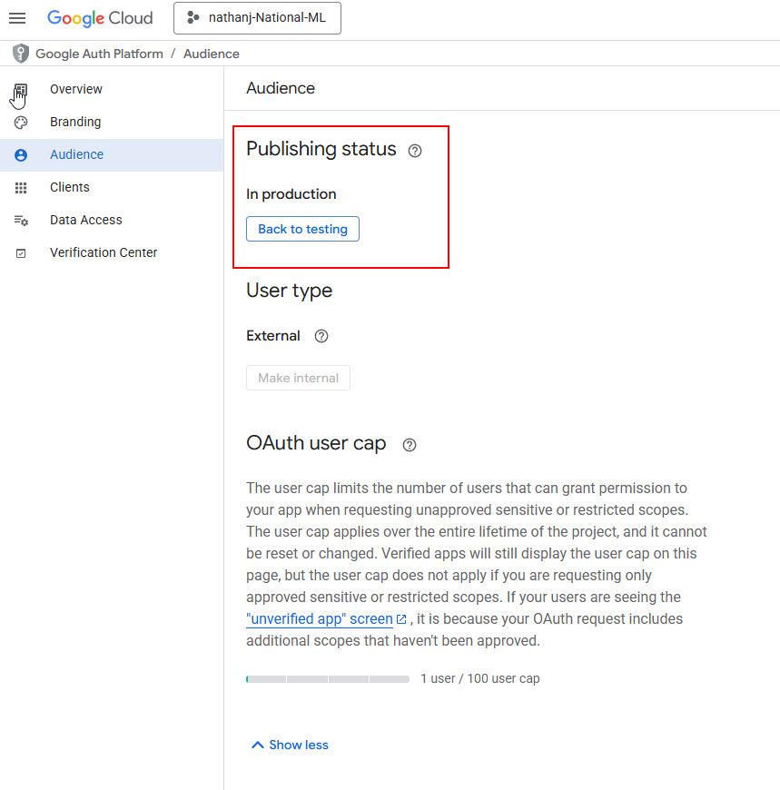

# Data Processing
*Update: Jun 12/ 2025 by Dingqi*

This is a script used for auto data collection.

* Create independent subfolders for each HUC in Google Drive.
* buffer the HUC boundary.
* Create the buffered rectangular bounding box.

Export seven types of data:
1. The buffered polygonal boundary (vector)
2. Rectangular outer frame (vector)
3. DEM (Grid)
4. Landsat optical image (grid)
5. Landsat thermal infrared image (grid)
6. SAR radar image (grid)
7. The flow direction of resampling (grid)

These data will be downloaded to `gee_downloads` folder as default.

For test, we randomly select HUC.

## Before use
### Prepare your python enviroment

Install Google Cloud CLI

``` bash
# get the package 
curl https://sdk.cloud.google.com | bash
```

Install earthengine-api:

``` bash
# GEE API
pip install earthengine-api

# access Google Drive API
pip install --upgrade google-api-python-client google-auth-httplib2 google-auth-oauthlibconda in
```

### Authenticate GEE and Google Drive respectively.

#### GEE authenticate:

```bash
earthengine authenticate
```

#### Google Drive API authenticate:
This is to give your Python script the permission to access your Google Drive.

    a. Go to the `Google Cloud Console`.

    b. Create a new project (or select an existing one).

    c. In the left menu, find `APIs & Services` -> `Enabled APIs & services`.

    d. Click `ENABLE APIS AND SERVICES`, search for `Google Drive API` and enable it.

    e. Return to `APIs & Services` -> `Credentials`.

    f. Click `CREATE CREDENTIALS` -> `OAuth client ID`.

    g. If required, configure the OAuth consent screen first. Select `External` and fill in the basic information such as the application name.

    h. Return to the credential creation page and select the application type as `Desktop app`.


 After creation, you will see a client ID and a key. Click the `Download JSON File` button on the right, download this file, rename it `credentials.json`, and then place it in the folder where your Python script is located.
 
 Do not forget to publish the app
 

 ## TODO
1. Check the result.


